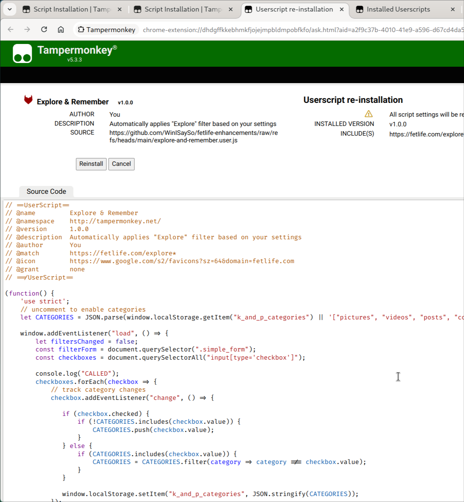

# FetLife Enhancements
What it says on the tin. Small userscripts to make the QoL of FetLife better for the user.

## The Enhancements
### Dependencies (Install First)
- [FetLife Utils (**required**)](https://github.com/WinISaySo/fetlife-enhancements/raw/refs/heads/main/fetlife-utils.user.js): Utility functions used by other userscripts on this page. 

### Other Enhancements
- [Explore & Remember](https://github.com/WinISaySo/fetlife-enhancements/raw/refs/heads/main/explore-and-remember.user.js): Remembers the filters you use in any of the "Explore" Tabs.
- [Disable View Counts](https://github.com/WinISaySo/fetlife-enhancements/raw/refs/heads/main/disable-view-counts.user.js): Disables the view-count number on posts.
- [Hate Button](https://github.com/WinISaySo/fetlife-enhancements/raw/refs/heads/main/hate-button.user.js): Transform the so-called "Downvote" button into a "Hate" button with similar styling and behavior to the "Love" button.
- [Explore Last Tab](https://github.com/WinISaySo/fetlife-enhancements/raw/refs/heads/main/explore-last-tab.user.js): Instead of always going to "Kinky & Popular", "Explore" will remember the last explore tab you visited (For You, Friends & Following, etc)
- [Red Flgas](https://github.com/WinISaySo/fetlife-enhancements/raw/refs/heads/main/red-flags.user.js): Highlight red flags on user profiles to make vetting easier.

## Help 
### Prerequisites
First, you'll need an extension that will let you manage your userscripts. We recommend [TamperMonkey](https://www.tampermonkey.net/), but [GreaseMonkey for Firefox](https://addons.mozilla.org/en-US/firefox/addon/greasemonkey/) has also been tested.

### Installing Enhancements
#### Pro Tip
If you install **FetLife Utils** *before* any other enhancement on this page, things should *just work*. If you didn't, you may need to make sure to reorder your userscripts such that FetLife Utils is first. Here's [a helpful article](https://www.mturkcrowd.com/threads/how-to-change-execution-order-of-userscripts-and-customize-excluded-pages.152/) on how to change the execution order of scripts if you need help.

#### How-To
To install a script, simply click a link below. On TamperMonkey, you should see an install screen like this (though it should say 'install' instead of 'reinstall' for you):

You can also click the files directly in GitHub's file browser if you'd like to
examine the code before installing. Rather than coming back here, you can click
the "Raw" button once you're finished auditing the code to install.

